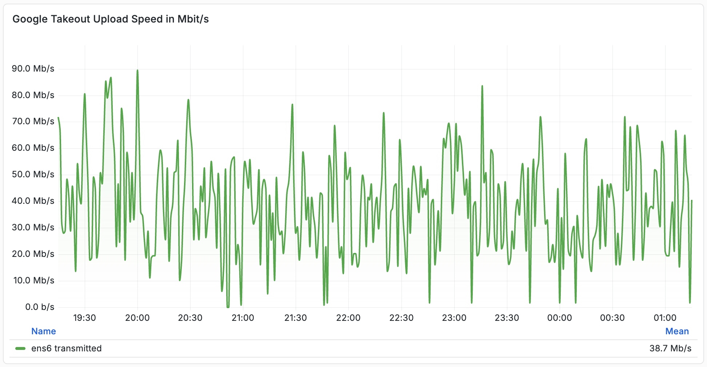
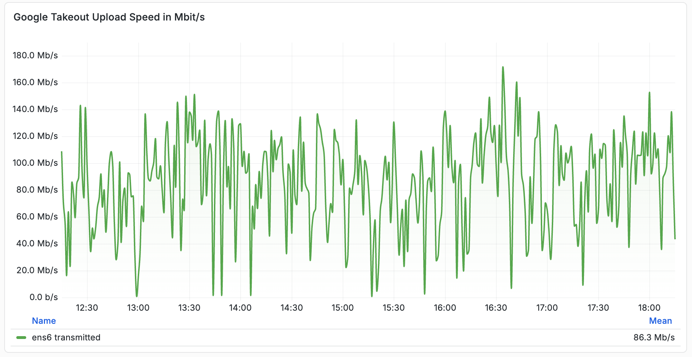

# gphotos-takeout

This project runs a lightweight, repeatable pipeline for Google Photos Takeout ZIP archives: it scans a Drive folder, streams matching archives directly to S3, and only removes each source file after a successful upload. The sync loop in `scripts/run-sync.sh` executes `rclone move` on a fixed interval (default hourly), filters for `takeout-*-NNN.zip` chunks, and applies configurable transfer/checker/concurrency settings through environment variables. In practice, that means no large local staging, predictable retries on failure, and automated cleanup of completed files from Google Drive.

## Quick start

### 1. Generate `rclone.conf`

```bash
mkdir /opt/gphotos-takeout && cd /opt/gphotos-takeout
docker run --rm -it \
  -v "$(pwd):/config/rclone" \
  rclone/rclone:latest \
  config
```

Create these remotes in the menu:

- `gdrive` (type `drive`, scope `drive`, login with your personal Google account)
- `s3` (type `s3`, provider `Other`, add your S3 details)

Change folder permissions:

```bash
chown -R 1000:1000 /opt/gphotos-takeout
```

### 2. Run

Change bucket name in [docker-compose.yml](./docker-compose.yml#L10):

```bash
nano docker-compose.yml
```

Start container:

```bash
docker compose up -d
```

## Tested VPS Offerings

### ✅ [Strato VC 1-1 (1 EUR/month)](https://www.strato.de/server/linux-vserver/)

#### Upload Speed with  `RCLONE_TRANSFERS=1`



#### Upload Speed with `RCLONE_TRANSFERS=2`

> [!CAUTION]
> I received multiple `Error 403: Quota exceeded for quota metric 'Queries' and limit 'Queries per minute' of service 'drive.googleapis.com' for consumer 'project_number:XXX'` errors with `RCLONE_TRANSFERS=2`.


