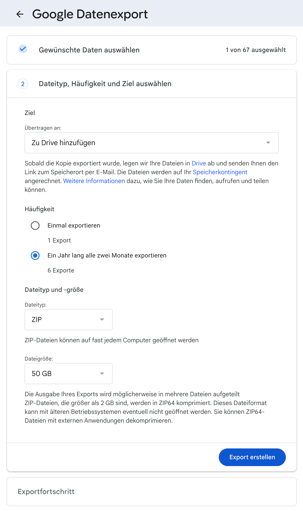
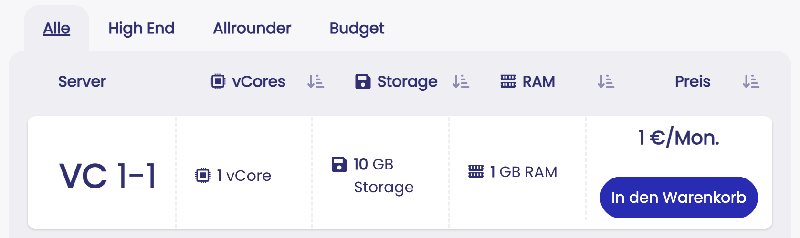
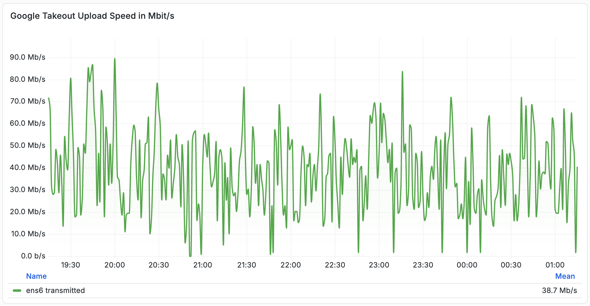
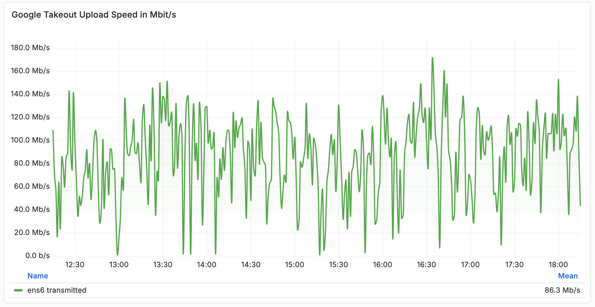

# 📦 Google Photos Takeout

This project runs a lightweight, repeatable pipeline for Google Photos Takeout ZIP archives: it scans a Drive folder, streams matching archives directly to S3, and only removes each source file after a successful upload. The sync loop in `scripts/run-sync.sh` executes `rclone move` on a fixed interval (default hourly), filters for `takeout-*-NNN.zip` chunks, and applies configurable transfer/checker/concurrency settings through environment variables. In practice, that means no large local staging, predictable retries on failure, and automated cleanup of completed files from Google Drive.

## Quick start

### 1. Set up Google Takeout

Set up Google Takeout via https://takeout.google.com/.



### 2. Create your own Google API credentials (required)

> [!IMPORTANT]
> rclone ships with a built-in, **shared** Google Drive OAuth client
> (`project_number:202264815644`). Its "Queries per minute" quota for
> `drive.googleapis.com` is pooled across every rclone user in the world who
> never created their own client — which is why you can hit
> `Error 403: Quota exceeded for quota metric 'Queries' ... for consumer
> 'project_number:202264815644'` even at `RCLONE_TRANSFERS=1`. Other rclone
> users are consuming the quota, not you.
>
> rclone's own documentation also states that this shared client
> **is being retired and will stop working during 2026**, so this step is
> required, not an optimization — skipping it means the pipeline will break
> outright, quota errors or not.

1. In the [Google Cloud Console](https://console.cloud.google.com/), create a new project.
2. Go to **APIs & Services → Library**, search for **Google Drive API**, and enable it.
3. Go to **APIs & Services → OAuth consent screen**, choose **External**, and fill in an app name plus your email as support and developer contact.
4. **Publish the app** (Production, not Testing). Testing mode expires refresh tokens after 7 days, which silently kills a multi-week Takeout transfer. Publishing an unverified app is fine for your own data — you just click through a one-time "unverified app" warning during authorization.
5. Go to **APIs & Services → Credentials → Create credentials → OAuth client ID**, application type **Desktop app**. Record the generated **client ID** and **client secret**.
6. Keep the OAuth scope as the full `drive` scope, not `drive.readonly` — the pipeline runs `rclone move`, which deletes each file from Drive after a successful upload, and a read-only scope breaks that cleanup while appearing to work otherwise.

### 3. Generate `rclone.conf`

```bash
mkdir /opt/gphotos-takeout && cd /opt/gphotos-takeout
docker run --rm -it \
  -v "$(pwd):/config/rclone" \
  rclone/rclone:latest \
  config
```

Create these remotes in the menu:

- `gdrive` (type `drive`, scope `drive`, paste the `client_id` / `client_secret` from step 2 when prompted, then log in with your personal Google account)
- `s3` (type `s3`, provider `Other`, add your S3 details)

Change folder permissions:

```bash
chown -R 1000:1000 /opt/gphotos-takeout
```

#### Already have a config from before step 2?

> [!WARNING]
> An existing `token =` in `rclone.conf` was issued to the old (shared)
> client and will not work once you add your own `client_id`. You must
> re-authorize.

Add the credentials from step 2 to the `[gdrive]` stanza in `/opt/gphotos-takeout/rclone.conf`:

```ini
[gdrive]
type = drive
scope = drive
client_id = xxxxxxxx.apps.googleusercontent.com
client_secret = GOCSPX-xxxxxxxx
```

Then re-authorize and fix ownership (rclone rewrites the file as root):

```bash
docker run --rm -it -v /opt/gphotos-takeout:/config/rclone \
  rclone/rclone:latest config reconnect gdrive:
chown -R 1000:1000 /opt/gphotos-takeout
```

On a headless VPS with no browser, run
`rclone authorize "drive" "<client_id>" "<client_secret>"` on a desktop machine
instead, then paste the resulting token when `config reconnect` asks for it.

Verify the new credentials took effect:

```bash
docker run --rm -v /opt/gphotos-takeout:/config/rclone rclone/rclone:latest config show gdrive
docker run --rm -v /opt/gphotos-takeout:/config/rclone rclone/rclone:latest lsd gdrive:Takeout
```

### 4. Run

Change bucket name in [docker-compose.yml](./docker-compose.yml#L10):

```bash
nano docker-compose.yml
```

Start container:

```bash
docker compose up -d
```

## Configuration reference

Beyond the required variables (`RCLONE_DRIVE_REMOTE`, `RCLONE_S3_REMOTE`), the
sync script exposes these optional tunables, all set as environment variables
in `docker-compose.yml`:

| Variable | Default | Purpose |
|---|---|---|
| `RCLONE_TRANSFERS` | `2` | Concurrent file transfers |
| `RCLONE_CHECKERS` | `4` | Concurrent existence/hash checks |
| `RCLONE_LOG_LEVEL` | `INFO` | rclone log verbosity |
| `RCLONE_S3_STORAGE_CLASS` | `STANDARD_IA` | S3 storage class for uploaded objects |
| `RCLONE_TPSLIMIT` | `10` | Global HTTP transactions/second ceiling (`0` disables) |
| `RCLONE_TPSLIMIT_BURST` | `20` | Burst allowance for `RCLONE_TPSLIMIT` |
| `RCLONE_DRIVE_PACER_MIN_SLEEP` | `1s` | Minimum sleep between Drive API calls |
| `RCLONE_DRIVE_PACER_BURST` | `10` | Drive API calls allowed before pacing kicks in |
| `RCLONE_MULTI_THREAD_STREAMS` | `1` | Concurrent read streams opened per file |
| `RCLONE_RETRIES` | `5` | Whole-operation retry attempts |
| `RCLONE_RETRIES_SLEEP` | `60s` | Delay between retry attempts |
| `RCLONE_LOW_LEVEL_RETRIES` | `20` | Low-level (single HTTP call) retry attempts |
| `RCLONE_DRIVE_STOP_ON_DOWNLOAD_LIMIT` | `true` | Treat Drive's daily download-quota error as fatal for the pass instead of retrying into it |
| `RCLONE_STATS_ONE_LINE` | `true` | Emit `--stats` as a single log line (friendlier for log aggregators) |
| `RCLONE_STATS` | `30s` | Interval between stats lines |
| `RCLONE_ADDITIONAL_ARGS` | (empty) | Extra flags appended verbatim to the `rclone move` call |
| `SCAN_INTERVAL_SECONDS` | `3600` | Delay between sync passes after a successful pass |
| `BACKOFF_MAX_SECONDS` | `21600` | Cap on the exponential backoff delay after failed passes |
| `BACKOFF_MULTIPLIER` | `2` | Backoff growth factor per consecutive failure |
| `BACKOFF_JITTER_PERCENT` | `10` | Random jitter applied to sleep intervals (`0` disables) |

The `RCLONE_*` tuning defaults above are intentionally conservative so the
pipeline survives even on the shared client_id. Once you have your own
client_id (step 2), consider raising `RCLONE_TRANSFERS` and
`RCLONE_MULTI_THREAD_STREAMS` for more throughput — see the benchmark below.

## Tested VPS Offerings

### ✅ [Strato VC 1-1 (1 EUR/month)](https://www.strato.de/server/linux-vserver/)



#### Upload Speed with  `RCLONE_TRANSFERS=1`: 38.7 Mbit/s Average



#### Upload Speed with `RCLONE_TRANSFERS=2`: 86.3 Mbit/s Average

> [!NOTE]
> These runs originally hit `Error 403: Quota exceeded for quota metric
> 'Queries' and limit 'Queries per minute' of service 'drive.googleapis.com'
> for consumer 'project_number:202264815644'` at `RCLONE_TRANSFERS=2`. That
> is **not** caused by `RCLONE_TRANSFERS=2` itself — `202264815644` is
> rclone's shared default client_id, and its quota is shared with every
> rclone user who hasn't completed step 2 above. With your own client_id,
> `RCLONE_TRANSFERS=2` is safe to use and more than doubles throughput
> (38.7 → 86.3 Mbit/s here).


